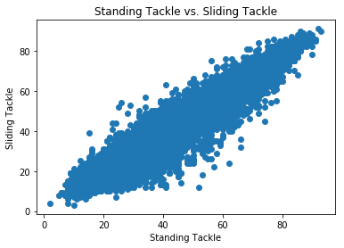

<h1 style='text-align:center'> Module 1 Assessment</h1>

This assessment is designed to test your understanding of the Mod 1 material. It covers:

* Python Fundamentals
* Working with Statistical Data
* Pandas and Numpy
* Data Visualization

Read the instructions carefully. You will be asked both to write code and respond to a few short answer questions.

#### Note on the short answer questions
For the short answer questions _please use your own words_. The expectation is that you have **not** copied and pasted from an external source, even if you consult another source to help craft your response. While the short answer questions are not necessarily being assessed on grammatical correctness or sentence structure, you should do your best to communicate yourself clearly.

## Python Fundamentals [Suggested Time: 20 min]

In the first section, we will work with various Python data types and try to accomplish certain tasks using some Python fundamentals. Below, we've defined a dictionary with soccer player names as keys for nested dictionaries containing information about each players age, nationality, and a list of teams they have played for.   


```
players = {
    'L. Messi': {
		'age': 31,
		'nationality': 'Argentina',
		'teams': ['Barcelona']
	},
	'Cristiano Ronaldo': {
		'age': 33,
		'nationality': 'Portugal',
		'teams': ['Juventus', 'Real Madrid', 'Manchester United']
	},
	'Neymar Jr': {
		'age': 26,
		'nationality': 'Brazil',
		'teams': ['Santos', 'Barcelona', 'Paris Saint-German']
	},
	'De Gea': {
		'age': 27,
		'nationality': 'Spain',
		'teams': ['Atletico Madrid', 'Manchester United']
	},
	'K. De Bruyne': {
		'age': 27,
		'nationality': 'Belgium',
		'teams': ['Chelsea', 'Manchester City']
	}
}
```

**1) Create a `list` of all the keys in the `players` dictionary. Use python's documentation on dictionaries for help if needed. Store the list of player names in a variable called `player_names` to use in the next question.**


```
# Get the list of all player names from the dictionary
player_names = None
```


```
print(player_names)
```

**2) Great! Now that we have each players name, let's use that information to create a `list` of `tuples` containing each player's name along with their nationality. Store the list in a variable called `player_nationalities`**


```
# Generate list of tuples such that the first element in the tuple is 
# a players name and the second is their nationality 
# Ex: [('L. Messi', 'Argentina'), ('Christiano Ronaldo', 'Portugal'), ...]
player_nationalities = None
```


```
print(player_nationalities)
```

**3) Now, define a function called `get_players_on_team` that returns a `list` of the names of all the players who have played on a given team.** 

Your function should take two arguments: 
* a dictionary of player information
* a `string` of the team you are trying to find the players for 

**Be sure that your function has a `return` statement.**


```
# Define your get_players_on_team function here.
```


```
players_on_manchester_united = get_players_on_team(players,'Manchester United')
print(players_on_manchester_united)
```

## Pandas  [Suggested Time: 15 minutes]

In this section you will be doing some preprocessing for a dataset for the videogame FIFA19 (https://www.kaggle.com/karangadiya/fifa19).  The dataset contains both data for the game as well as information about the players' real life careers.

**1) Read the CSV file into a pandas dataframe**

The data you'll be working with is found in a file called `'./data/fifa.csv'`.  Use your knowledge of pandas to create a new dataframe using the csv data. 

Check the contents of the first few rows of your dataframe, then show the size of the dataframe


```
import pandas as pd
import numpy as np
import warnings
warnings.filterwarnings('ignore')
```


```
df = None
```


```
# code here to see the size of the dataframe

```

**2. Drop n/a rows for "Release Clause"**
    
**Drop rows for which "Release Clause" is none or not given. This is part of a soccer player's contract dealing with being bought out by another team. After you have dropped them, see how many rows are remaining.**


```
# code here to drop n/a rows

```


```
# now check how many rows are left 

```

**3) Convert the Release Clause Price from Euros to Dollars**

Now that there are no n/a values, we can change the values in the `Release Clause` column from Euro to Dollar amounts.

Assume the current Exchange Rate is
`1 Euro = 1.2 Dollars`


```
 # code here to convert the column of euros to dollarss

```

## Data Visualization [Suggested Time: 20 minutes]

Continuing to use the same FIFA dataset, plot data using whichever plotting library you are most comfortable with.


```
# Don't forgot to run this cell
import matplotlib.pyplot as plt
import seaborn as sns
%matplotlib inline
```

**1) Find the top 10 countries with the most players (using the 'Nationality' column). Create a bar chart showing the number of players in those 10 countries**

Don't forget to add a **title** and **x axis label** to your charts.

If you are unable to find the top 10 countries but want the chance to demonstrate your plotting skills use the following dummy data to create a bar chart
```
Country Name  | Num Players
============  | ===========
Country A     | 100
Country B     | 60
Country C     | 125
Country D     | 89
```


```
# code here to get the top 10 countries with the most players

```


```
# code here to plot a bar chart
plt.figure(figsize=(10, 6))

```

**2) Below is a scatter plot for the player stats `StandingTackle` and `SlidingTackle`**

**How would you describe the relationship between these two features.**


```
plt.scatter(df['StandingTackle'], df['SlidingTackle'])
plt.title('Standing Tackle vs. Sliding Tackle')
plt.xlabel('Standing Tackle')
plt.ylabel('Sliding Tackle')
plt.show()
```





```
"""
Your written answer here
"""
```

## Exploring Statistical Data [Suggested Time: 20 minutes]

**1) What are the mean age and the median age for the players in this dataset?** 

In your own words, how are the mean and median related to each other and what do these values tell us about the distribution of the variable 'Age'


```
# code here
```


```
"""
Your written answer here
"""
```

**2) Who is the oldest player in Argentina and how old is he?**  


```
# code here
```


```
# Your written answer here
```
